# BullT(쇼핑몰 앱) from JAVA

### 사진 설명 순서 →
* 스플래쉬 화면
* 메인화면
* 검색화면

 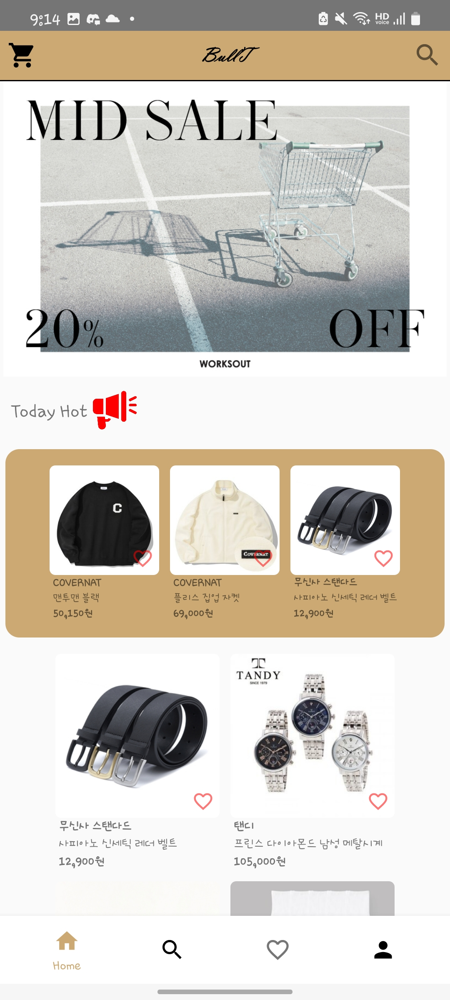 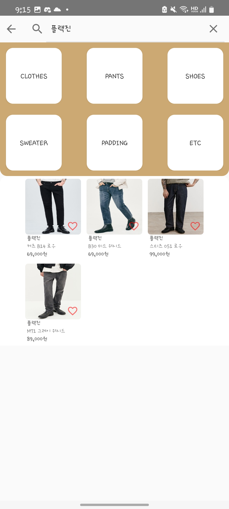

* 메인화면 로그인 필요한 heartCount기능
* 상품 사이즈 화면
* 마이페이지 화면

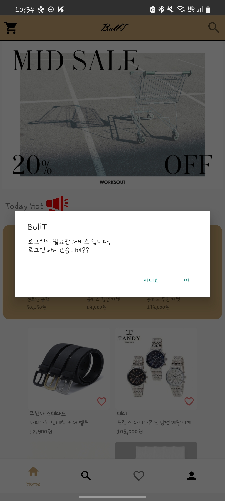 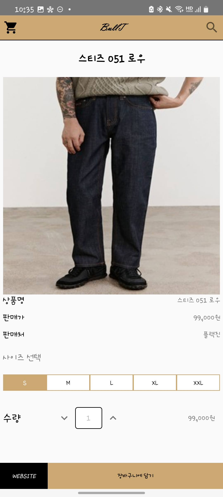 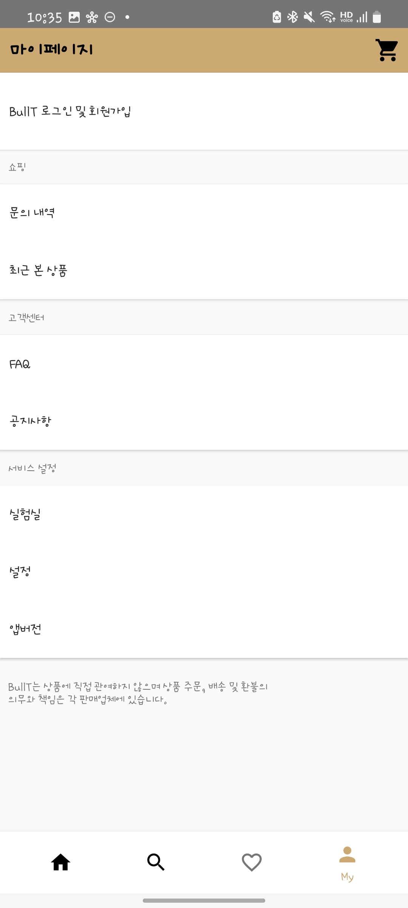

* 회원 가입화면
* 로그인 화면
* 로그인 성공화면

 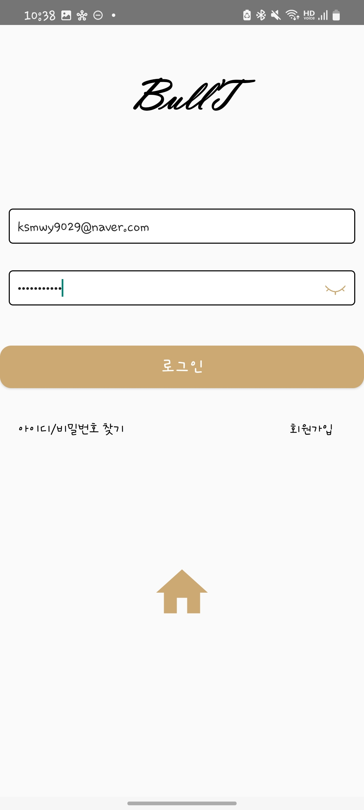 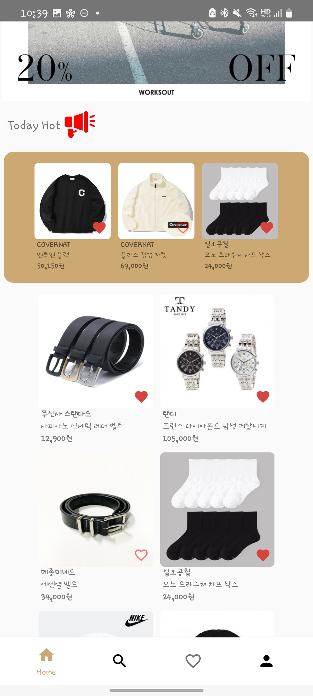

* 즐겨 찾기 화면
* 정렬 방법(큰 바둑판 4*y , 작은 바둑판 3*y, 수직 정렬)
* 장비구니 추가
* 추가한 물건 구매방법(실제 구매X)

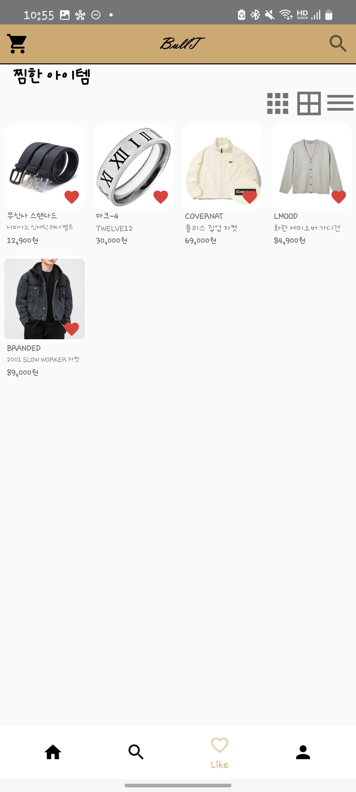 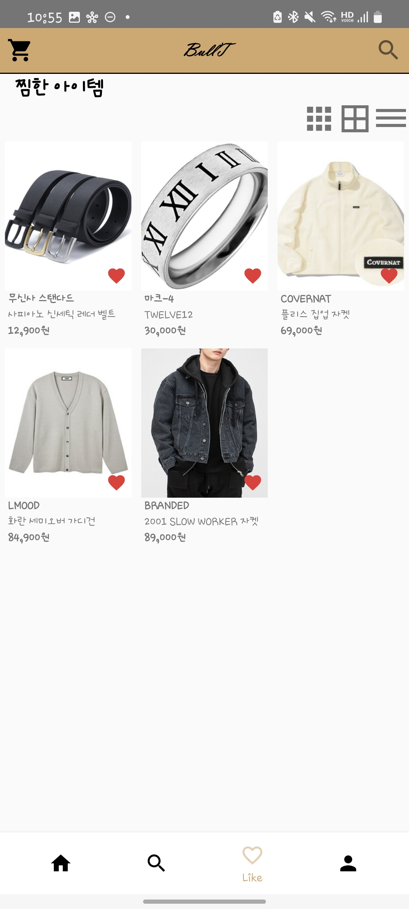 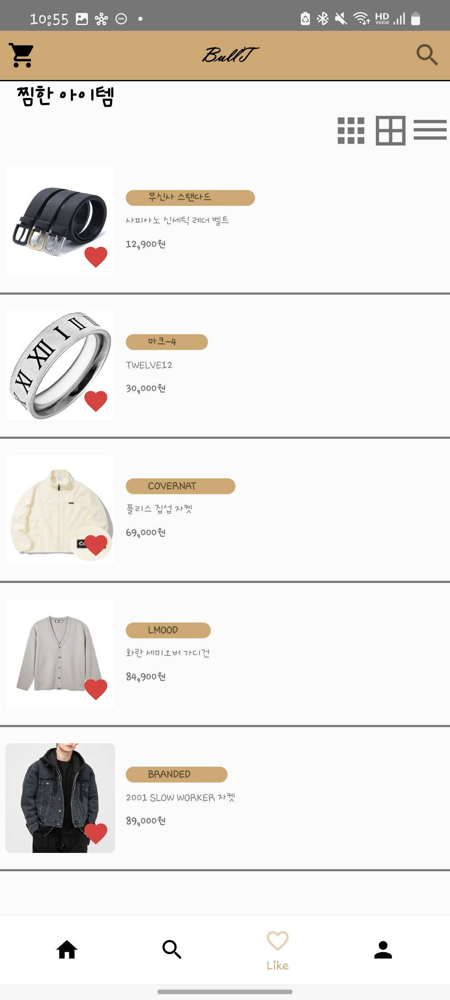
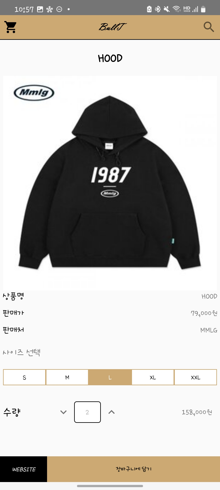 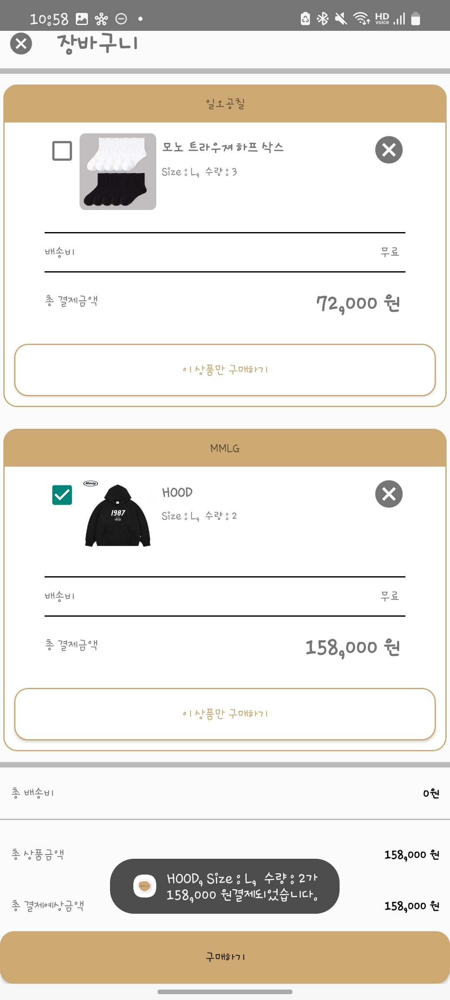

<!--
# BullT(ショッピングモールアプリ)

### 写真の説明手順 →
* スプラッシュ画面
* メイン画面
* 検索画面

  

* ログインせずにログイン必須機能を使用しようとする画面です
* 商品サイズ画面
* マイページ画面

  

* 会員登録画面
* ログイン画面
* ログイン成功画面

  

* 蒸しリスト画面
* 整列方法(大きい碁盤4*y、小さな碁盤3*y、垂直整列)
* 装備バッグを追加
* 追加したものを購入します(実際の購入X)

  
 
-->
